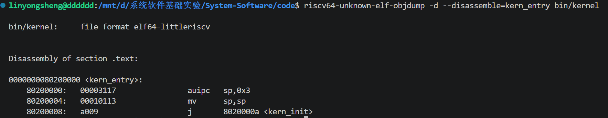
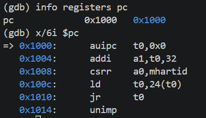
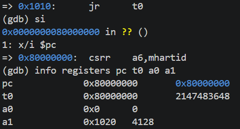
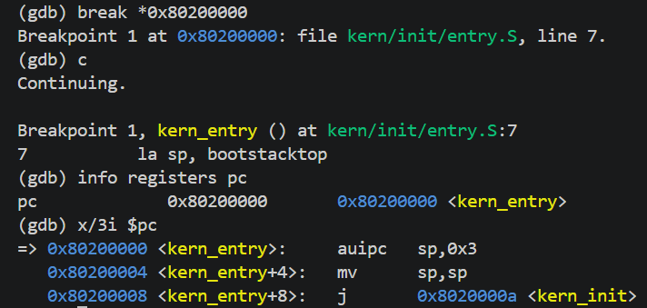

# 实验报告

## 实验基本信息

| 项目 | 内容 |
|------|------|
| **实验名称** | Lab 1: [比麻雀更小的麻雀（最小可执行内核）] |
| **小组成员** | 2511107-林永盛、2511592-陈逍宇、2513411-邱宇湛 |
| **完成日期** | 2026-10-08 |

### 小组分工

练习如何分工？

| 成员 | 负责的练习/模块 |
|------|----------------|
| 2511107-林永盛 | [练习1、练习2] |
| 2511592-陈逍宇 | [练习1、练习2] |
| 2513411-邱宇湛 | [练习1、练习2] |

实验报告如何分工？

| 成员 | 负责的部分 |
|------|----------------|
| 2511107-林永盛 | [四、实验内容与实现 五、测试与验证] |
| 2511592-陈逍宇 | [一、实验目的 三、实验整体逻辑分析] |
| 2513411-邱宇湛 | [六、实验总结与收获 三、实验整体逻辑分析] |
---

## 一、实验目的

<!-- 说明本次实验的主要目标和预期成果 -->

本实验的主要目的是：

1. 理解RISCV平台上操作系统内核的启动流程，掌握CPU从复位入口经OpenSBI固件进入内核的执行过程，理解在此过程中固件的重要作用。

2. 理解内核入口代码`kern/init/entry.S`的作用，分析`la sp, bootstacktop`设置启动栈指针和`tail kern_init`跳转到内核初始化函数的操作，认识进入C语言代码前建立基本运行环境的必要性。

3. 掌握QEMU与GDB联合调试的基本方法，通过查看反汇编、单步执行、设置断点和检查寄存器，验证复位入口、固件入口及内核入口之间的控制流，并观察内核第一条指令的执行结果。
---

## 二、实验环境

你们使用的 AI 工具

| 成员 | AI 编程工具 | 底层模型 | 备注 |
|------|------------|---------|------|
| 2511107-林永盛 | [Codex（终端 Agent） ] | [GPT-6.1 Sol] | [高] |
| 2511592-陈逍宇 | Codex(vsCode插件) | GPT-6 Astra | 中 |
| 2513411-邱宇湛 | [Codex（终端 Agent） ] | [GPT-6.1 Sol] | [高] |

**说明：**
- **AI 编程工具**：指具体使用的终端工具、编辑器插件、桌面应用或浏览器界面
- **底层模型**：指该工具使用的大语言模型及版本

---

## 三、实验整体逻辑分析

### **2.1 本章节的逻辑主线**

本章节围绕“如何让一个最小操作系统内核从加电启动到成功输出信息”展开。

整体思路是：先通过交叉编译和链接确定内核的布局，生成可加载的镜像；再借助 QEMU 和 OpenSBI 使 CPU 进入内核；随后由入口汇编建立内核栈，转入 C 语言初始化函数；最后通过 SBI 服务输出启动信息，并使用 GDB 验证这一过程。

本次实验平台上的执行主线为：

CPU 从复位地址 0x1000 开始执行复位 ROM  
↓  
准备启动参数并读取固件入口地址  
↓  
进入 0x80000000 的 OpenSBI（M 模式）  
↓  
初始化运行环境，通过 mret 移交控制权  
↓  
进入 0x80200000 的 kern_entry（S 模式）  
↓  
设置内核栈指针 sp  
↓  
转入 C 语言函数 kern_init()  
↓  
清理 .bss，调用 cprintf()  
↓  
通过 SBI 输出启动信息  
↓  
进入无限循环

### **2.2 功能的逐步实现**

本实验以已有的最小内核代码为基础，按照“确定布局与构建镜像、固件引导、建立内核执行环境、初始化与输出、调试验证”的顺序理解各模块之间的关系。

**1. 确定内存布局并构建内核镜像**

首先分析 tools/kernel.ld 链接脚本和 Makefile 构建文件。链接脚本指定入口符号 kern_entry 和内核起始地址 0x80200000，并安排代码段、只读数据段、数据段及 .bss 段的位置。

构建过程将 C 和汇编源码编译成目标文件，再链接生成 ELF 文件，最后转换为内核镜像。这样，加载位置才能与内核预期的运行地址一致。

**2. 从复位代码进入 OpenSBI，再进入内核**

QEMU 预加载镜像后，CPU 从 0x1000 的复位 ROM 开始执行。最初的几条指令准备启动参数、读取硬件线程编号和固件入口地址，然后跳转到 0x80000000 的 OpenSBI。

OpenSBI 完成运行环境初始化后，通过 mret 将控制权交给 0x80200000 的内核入口，并使内核在 S 模式运行。这里的复位 ROM 和 OpenSBI 是两个不同的启动阶段。

**3. 通过入口汇编建立内核栈**

进入入口汇编 kern/init/entry.S 后，先执行 la sp, bootstacktop，将预留启动栈的栈顶地址写入 sp，为后续 C 函数调用、寄存器保存和局部数据存储提供有效的栈空间。

随后执行 tail kern_init，不写入新的返回地址，直接转入内核初始化函数。该阶段的重点是理解：C 代码开始运行前，需要先准备好它依赖的基本执行环境。

**4. 完成 C 语言初始化与启动信息输出**

在内核初始化代码 kern/init/init.c 中，kern_init() 使用链接器定义的 edata 和 end 确定待清零区域，再通过 memset() 完成初始化。

之后调用 cprintf() 输出启动字符串，其主要调用关系为：

cprintf 调用 vprintfmt，后续依次经过 cputch、cons_putc、sbi_console_putchar 和 sbi_call，最终执行 ecall。

上层函数负责格式化和逐字符输出，底层通过 ecall 请求 OpenSBI 的控制台服务。这样，内核不依赖普通应用程序的标准库运行环境，也能输出信息。输出结束后，kern_init() 进入无限循环，不返回入口汇编。

**5. 使用 GDB 将源码分析与实际执行对应起来**

调试时，让 QEMU 在 CPU 开始执行前暂停，再由 GDB 连接模拟器。先检查初始 PC 并单步跟踪复位代码，确认 CPU 从 0x1000 进入 0x80000000；

随后在 0x80200000 设置执行断点，确认控制权已经交给内核。继续单步检查栈指针的变化和进入 kern_init() 的跳转，最后结合终端输出验证初始化代码已经执行。

---


## 四、实验内容与实现

<!-- 
说明：本部分按照 exercises 文档中的练习顺序组织
每个功能模块或者练习中可能包含多项任务，请根据实际情况调整
-->

<!-- ### 功能模块：[模块名称]

**负责人：** [学号-姓名]

#### 模块功能描述

**需要实现/修改的函数：**

```c
// 列出本模块涉及的所有函数签名
void example_function(void);
int another_function(int arg);
```

**功能说明：**

[简要描述该模块的功能，包括：
- 该模块在整个系统中的作用
- 需要处理的主要场景
- 与其他模块的交互关系]

#### 最终提示词

以下是经过迭代优化后，最终成功实现该功能的提示词：

````markdown

[按照提示词模板，给出具体的提示词]

````

#### 实现迭代过程

本模块的实现经历了 [N] 次迭代，过程如下：

---

##### 第一次迭代

如果设计的prompt生成代码后出现问题：

**遇到的问题：**
- 问题1：问题描述、错误信息和原因分析
- 问题2：问题描述、错误信息和原因分析

**问题解决策略：**
- 针对问题1：[说明如何修改提示词]
- 针对问题2：[说明如何修改提示词]

如果没有问题：

**最终结果：**

经过 [N] 次迭代，该模块最终：
- ✅ 编译通过
- ✅ 所有相关测试通过
- ✅ 功能符合预期

**关键改进点总结（如有）：**
1. [改进点1：例如，在 [RELY] 中补充了完整的系统调用号定义]
2. [改进点2：例如，在 [SPECIFICATION] 中明确了异常处理的边界条件]
3. [改进点3：例如，增加了对用户指针合法性检查的要求]

---

##### 第二次迭代（如有）

[按照和第一次迭代相同的格式]

---

##### 第三次迭代（如有）

[按照和第一次迭代相同的格式]

--- -->

### 练习：[练习1：理解内核启动中的程序入口操作]

**负责人：** [2511107-林永盛]

1. la sp, bootstacktop 
- 完成操作：加载地址，将栈指针sp赋值为bootstacktop栈顶地址。  
- 目的：将内核栈顶地址写入栈指针寄存器，后续函数可能需要在栈中保存寄存器、返回地址和局部数据。  
2. tail kern_init 
- 完成操作：跳转到kern_init
- 目的：将控制权转交给内核初始化函数；由于该函数不会返回，采用尾调用。

### 练习：[练习2：使用GDB验证启动流程]

**负责人：** [2511107-林永盛]  
使用两个 WSL 终端，分别执行 make debug 和 make gdb。连接后观察到初始 PC 为 0x1000，使用 si 单步执行五条指令，确认 PC 跳转至 0x80000000。随后在 0x80200000 设置断点并继续执行，程序停在 uCore 内核入口。
| 地址 | 指令 | 主要功能 |
|---|---|---|
| `0x1000` | `auipc t0,0x0` | 将当前指令地址加上 0，得到 `t0 = 0x1000` |
| `0x1004` | `addi a1,t0,32` | 得到 `a1 = 0x1020`，作为传给固件的启动参数 |
| `0x1008` | `csrr a0,mhartid` | 获取当前硬件线程编号，放入 `a0`；本次观察为 0 |
| `0x100c` | `ld t0,24(t0)` | 从内存地址`0x1000 + 24 = 0x1018` 读取 8 字节(0x0000000080000000)，放入`t0`|
| `0x1010` | `jr t0` | 跳转到 `0x80000000`，开始执行 OpenSBI |

---

## 五、测试与验证

<!-- 根据该实验的具体情况，提供完整的测试运行截图，应包含：
- 编译及运行成功的输出（make qemu），可能有多个
- 测试通过的结果（make grade），只有一个
-->

**测试截图：**  
练习1截图:
  
图 1：内核入口的反汇编结果，展示了 la sp, bootstacktop 和 tail kern_init 对应的实际指令。 0x80200000 + 0x3000(0x3左移十二位) = 0x80203000(bootstacktop的地址)、mv sp,sp 保持该值、跳转到 kern_init，地址为 0x8020000a

---

练习2截图：  
  
图 2：CPU 初始 PC 为 0x1000，将当前指令地址加上 0，得到 t0 = 0x1000、得到 a1 = 0x1020，用于传递启动信息所在位置、读取当前硬件线程的编号，放入 a0、从内存地址 0x1000 + 24 = 0x1018 读取 8 字节(0x0000000080000000)，放入 t0、跳转到 t0 指定的地址，进入 OpenSBI

---

  
图 3：执行 0x1010 处的 jr t0 后，PC 变为 0x80000000，进入 OpenSBI；寄存器结果同时验证了跳转目标和启动参数

---

  
图 4：程序运行到0x80200000 处的断点，CPU 已进入 kern_entry。 

---

## 六、实验总结与收获

### 对操作系统的理解

#### 1. 本实验的重要知识点及其与 OS 原理的对应关系

通过阅读 Lab 1 的全部内容，并结合入口代码分析和 GDB 调试，我们认识到：操作系统内核不会在加电后直接从 C 函数开始运行，而是需要固件、链接布局和启动汇编共同准备运行条件。本实验虽然最终只输出启动信息并进入无限循环，却把“内核怎样开始执行”这一过程具体展示了出来。

| 本实验的重要知识点 | 对应的 OS 原理知识点 | 含义、关系与差异 |
|---|---|---|
| 复位入口、OpenSBI 与内核之间的控制权交接 | 操作系统的引导与初始化 | 本次 QEMU 平台从 `0x1000` 的复位 ROM 开始执行，随后进入 `0x80000000` 的 OpenSBI，最后进入 `0x80200000` 的内核入口。它体现了系统分阶段启动、逐步建立运行环境的过程。与真实计算机可能需要从磁盘读取内核不同，本项目由 QEMU 在 CPU 执行前预加载镜像，OpenSBI 主要负责初始化和移交控制权。这些具体地址也不是所有 RISC-V 机器统一规定的。 |
| OpenSBI 的 M 模式与内核的 S 模式 | 特权级、保护机制与分层设计 | 固件与内核运行在不同特权级。本次启动中，OpenSBI 通过设置返回地址和目标特权级，再执行 `mret` 进入 S 模式内核。这说明控制权交接不仅是改变 PC，还涉及执行权限的改变。本实验只观察了固件到内核的交接，尚未建立用户进程及 U 模式到内核的完整保护机制。 |
| `la sp, bootstacktop` 与 `tail kern_init` | 内核执行环境、栈与函数调用约定 | `la` 将预留启动栈的栈顶地址写入 `sp`，让后续 C 函数能够使用内核自己的栈；它不是在执行时才动态分配栈。`tail` 将控制权转给不会返回的 `kern_init()`，不写入新的返回地址。本次启动栈大小为 8 KiB，栈向低地址增长。它是后续理解内核栈和上下文保存的基础，但不等于已经实现进程切换或每个进程独立的内核栈。 |
| 链接脚本、程序分段与 `.bss` 初始化 | 程序的内存布局与装载 | 链接脚本规定入口符号、代码和数据的排列及地址，使内核布局与加载位置一致。`.text` 保存代码，`.rodata` 保存只读数据，`.data` 保存已初始化的可读写数据，`.bss` 对应需要清零的数据；`kern_init()` 利用链接器提供的 `edata`、`end` 符号完成清零。本实验主要处理静态布局和启动初始化，并没有实现页表映射或动态内存分配。 |
| 交叉编译、ELF 文件与二进制镜像 | 可执行程序的生成、链接与装载 | 在宿主机上使用面向 RISC-V 的工具链，把源码编译为目标文件，再链接为 ELF 文件并转换成供 QEMU 加载的镜像。ELF 可保留符号和调试信息，原始二进制镜像则需要外部指定加载位置。二者服务于同一个内核，但调试用途与加载方式不同；生成了镜像也不代表它一定能正确运行，还要检查指令集和运行平台是否兼容。 |
| `cprintf()` 到 SBI 字符输出的逐层封装 | I/O 抽象、分层接口与异常陷入 | 内核不能直接依赖普通应用程序使用的标准库运行环境，因此通过格式化函数、控制台封装和 SBI 接口完成输出，最终由 `ecall` 请求 M 模式固件服务。这体现了上层功能建立在下层接口之上的设计。SBI 调用与用户程序的系统调用都有受控陷入的思想，但本实验是 S 模式内核请求 M 模式固件服务，不是 U 模式程序请求内核服务。 |
| QEMU 与 GDB 联合调试 | 指令执行、寄存器状态与运行上下文 | 通过观察 PC、SP、启动参数及反汇编，可以把源码含义与实际机器行为对应起来。单步适合分析短小的入口代码，断点适合跨过大量固件代码。实验还让我们区分了“执行到某地址”和“向某地址写入数据”：前者对应执行断点，后者对应写观察点，不能用一种现象替代另一种现象的证据。 |

我们最直接的收获，是能把“内核启动”拆解成可以逐步验证的过程：先完成控制权交接，再建立内核栈，随后进行 C 代码初始化，最后通过底层输出接口给出运行结果。看到启动字符串，只能说明内核已经走到了输出代码，并不意味着它已经具备完整操作系统的功能。

#### 2. OS 原理中重要，但本实验尚未实现或验证的知识点

指导书提到了一些后续实验的方向，但当前使用的是最小可执行内核，以下机制还没有在本实验中实际实现：

1. **进程、线程与 CPU 调度。** 当前只有一条内核执行流，输出后进入无限循环，没有进程控制块、就绪队列、调度算法和上下文切换，因此还不能体现操作系统如何让多个任务共享 CPU。
2. **完整的内存管理与虚拟内存。** 本实验涉及段布局、地址对齐和启动栈，但没有实现物理页分配、页表、地址空间隔离、缺页处理及页面置换。静态地安排内核地址，与运行时管理多个进程的内存是不同层次的问题。
3. **用户态程序与系统调用。** 我们了解了特权级和 `ecall` 的作用，但没有加载用户程序，也没有建立用户态到内核态的系统调用接口、参数检查和返回路径，尚未验证内核怎样安全地为应用程序提供服务。
4. **内核中断处理与设备管理。** SBI 输出涉及异常陷入，但本实验没有自行实现完整的内核陷阱入口、时钟中断处理、外部中断分发或复杂设备驱动；也没有实现由时钟中断驱动的抢占式调度。
5. **并发、同步与死锁。** 当前没有多个任务并发访问共享数据的情形，因此没有实践锁、信号量、互斥、竞态条件和死锁处理。本实验结束时的无限循环也不等同于操作系统原理中的死锁。
6. **文件系统与持久化存储。** 将内核镜像交给 QEMU 加载，不等于内核已经具备文件系统。本实验没有实现磁盘读写、目录管理、文件操作接口及缓存机制。

### AI 协作开发的经验

本次与 AI 协作的主要价值，不是让 AI 替我们得出结论，而是帮助我们把陌生的项目拆开，再用源码和调试结果判断解释是否正确。结合本次实际过程，我们有以下体会：

1. **先建立整体框架，再分析具体指令。** 一开始如果只看 `la` 和 `tail`，容易停留在“赋值、跳转”的字面解释。先让 AI 梳理启动顺序、文件职责和输出调用链，再回到入口代码，就能理解为什么需要先设置栈，以及为什么随后转入不会返回的 C 函数。
2. **提供具体材料，比笼统地问“为什么运行不了”更有效。** 把项目路径、实验题目、相关源码、工具版本和错误信息一并提供给 AI，有助于缩小排查范围。本次遇到较新编译器与较旧模拟器的兼容问题时，检查目标指令集和构建参数，比直接修改内核逻辑更合适。
3. **AI 的解释必须有证据，不能因为说得通顺就直接写入报告。** 对启动地址、栈地址和指令作用，我们结合反汇编、寄存器值与执行结果进行核对。例如，`la`、`tail` 是伪指令，最终机器指令应以本次构建为准，不能把某一次展开形式当成所有工具链的固定结果。
4. **遇到与预期不一致的现象，要检查假设，而不是补写预期结果。** 指导书提示用观察点捕捉内核加载，但本项目在 CPU 停于复位入口时，内核代码已经存在于目标地址，因此写观察点未触发不能直接说明加载失败。结合 QEMU 的加载参数，我们区分了镜像预加载与 CPU 执行到内核入口这两件事。这让我们认识到，AI 和指导材料中的概括都需要结合当前环境验证。
5. **保留原始记录，并控制修改范围。** 本次保留了构建参数、反汇编和调试日志，使结论可以回查；环境或调试脚本有问题时，修正后需要重新运行验证，而不是只修改报告描述。同时，没有必要为完成阅读和调试练习而随意改动原有内核源码，也不能把理论上知道的机制写成已经实现的功能。

总体而言，我们更认可“AI 帮助定位问题和解释代码，人通过源码、文档与运行证据作出判断”的协作方式。最终写入报告的内容，应当是我们能够解释、核对和复现的结论，而不是未经验证的生成文本。

---

